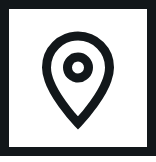
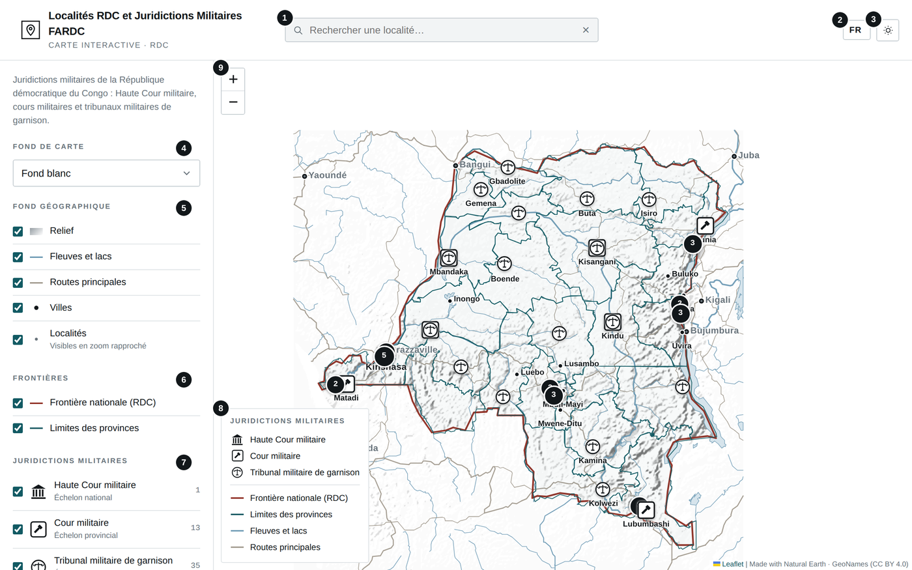
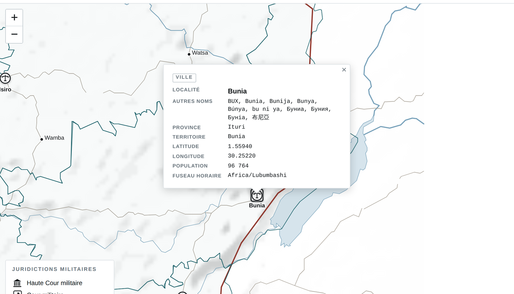
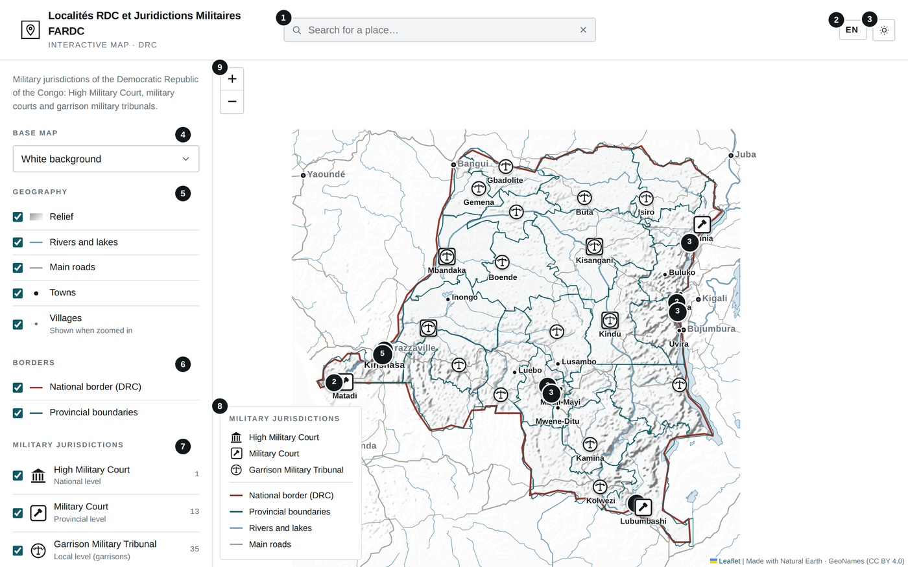
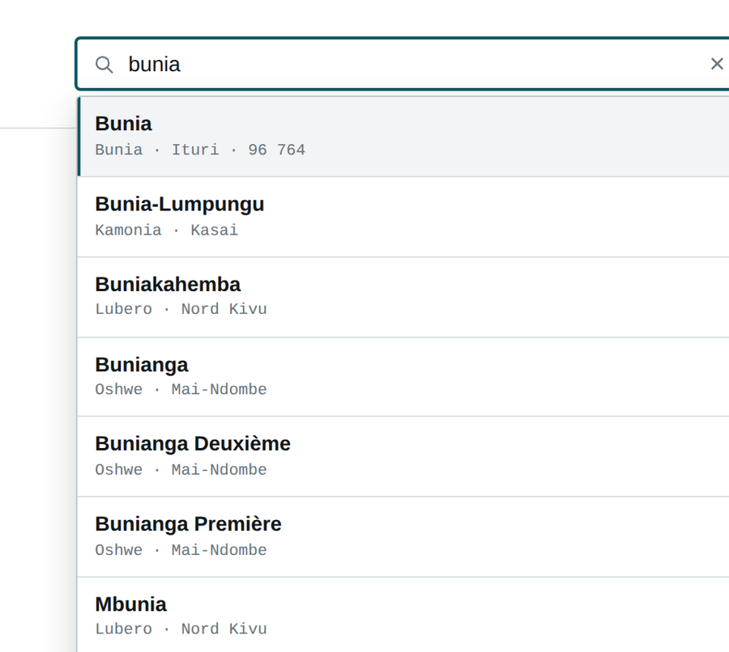
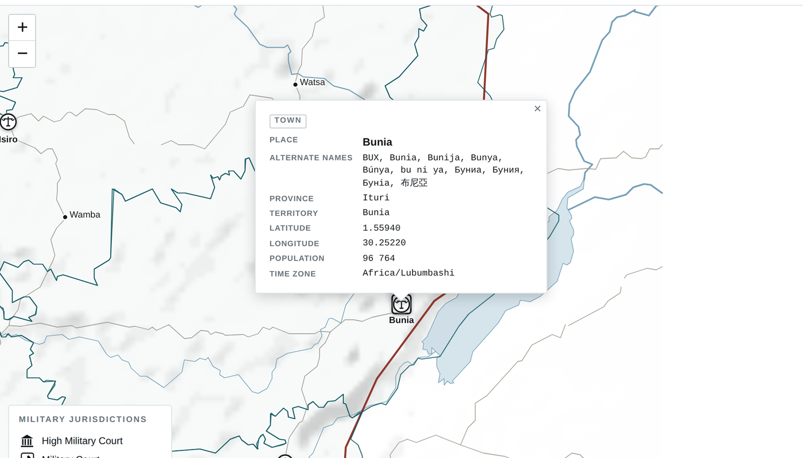

# Localités RDC et Juridictions Militaires FARDC · DRC Places and FARDC Military Jurisdictions

**`LOCALITES_RDC_ET_JURIDICTIONS_MILITAIRES_FARDC.html`** · Carte interactive · 49 juridictions · 36 913 localités recherchables — *Interactive map · 49 jurisdictions · 36,913 searchable places*

**[Français](#français) · [English](#english)**

---

## Français

### À quoi sert cet outil

Cette carte interactive situe les 49 juridictions militaires de la RDC (Haute Cour militaire, cours militaires et tribunaux militaires de garnison) ainsi que 36 913 localités du pays. Elle permet de rechercher une localité par son nom ou par un nom alternatif, d'afficher ses informations (province, territoire, coordonnées, population) et de visualiser frontières, provinces, relief, cours d'eau et routes.

### Avant de commencer

- Ouvrez le fichier LOCALITES_RDC_ET_JURIDICTIONS_MILITAIRES_FARDC.html par double-clic : il s'affiche dans votre navigateur (Chrome, Edge, Firefox ou Safari récents). Aucune installation n'est nécessaire.
- Le fond Satellite (par défaut), le fond Topographique et les fonds Google nécessitent Internet. Sans connexion, la carte passe automatiquement sur un fond uni et tout le reste fonctionne : juridictions, localités, recherche, relief, fleuves et routes.
- La langue (FR, EN, SW, LN) se choisit en haut à droite ; le bouton voisin bascule entre thème clair et sombre. Ces choix et le fond de carte sont mémorisés.

### L'écran en un coup d'œil

1. Recherche d'une localité par nom ou nom alternatif
2. Langue de l'interface
3. Thème clair ou sombre
4. Fond de carte : Satellite, Topographique, fond blanc ou noir (et Google si disponible)
5. Fond géographique hors ligne : relief, fleuves et lacs, routes, villes, localités
6. Frontière nationale et limites des provinces
7. Types de juridictions à afficher, avec leur nombre
8. Légende de la carte
9. Zoom (la molette ou le pincement fonctionnent aussi)

### Utilisation pas à pas

1. Naviguez avec le zoom, la molette ou en faisant glisser la carte. Les villes, puis les localités, apparaissent au fur et à mesure du zoom. Les juridictions proches sont regroupées dans un cercle numéroté : cliquez dessus pour le déplier.
2. Cliquez sur un pictogramme de juridiction pour afficher sa fiche : type, nom, ville ou commune, province et coordonnées GPS.
3. Survolez le nom ou le point d'une localité pour afficher ses informations ; cliquez pour garder la fenêtre ouverte.
4. Pour rechercher, tapez au moins deux lettres dans la barre en haut. Choisissez un résultat avec la souris, ou avec les flèches puis Entrée : la carte zoome sur la localité, la signale par un cercle et ouvre sa fenêtre.
5. Dans le panneau de gauche, choisissez le fond de carte et cochez ou décochez les couches et les types de juridictions. Sur téléphone, ouvrez ce panneau avec le bouton ☰.

#### Ce qui s'affiche selon le zoom

| Niveau de zoom | Éléments visibles |
|---|---|
| **Pays** | Kinshasa et capitales des pays voisins |
| **Plus près** | Chefs-lieux de province |
| **Région** | Villes de plus de 100 000 habitants |
| **Plus près encore** | Toutes les villes dont la population est connue |
| **District** | Toutes les localités, sous forme de points |
| **Rapproché** | Noms des localités |

### Résultat

*Résultats de recherche : nom, territoire, province et population.*

*Fenêtre d'une localité, ouverte depuis la recherche.*

### Bonnes pratiques

- Les coordonnées des juridictions et des localités sont approximatives : vérifiez-les avant tout usage officiel.
- La recherche ignore accents, majuscules et tirets, et trouve aussi les anciens noms (« Léopoldville » renvoie à Kinshasa).
- Plusieurs localités portent le même nom : vérifiez le territoire et la province affichés dans la liste avant de choisir.
- Les données sont intégrées au fichier et ne se mettent pas à jour automatiquement.

### En cas de problème

| Problème | Solution |
|---|---|
| **La carte s'affiche sur fond blanc au lieu du satellite** | Pas de connexion ou serveur indisponible : la carte est passée automatiquement sur le fond uni. Une fois connecté, choisissez à nouveau « Satellite ». |
| **Aucune localité visible** | Zoomez davantage (les points apparaissent à l'échelle d'un district) et vérifiez que « Localités » est coché. |
| **La recherche ne trouve rien** | Tapez au moins deux lettres et essayez une autre orthographe ou un nom alternatif. |
| **La frontière nationale est légèrement décalée en zoom rapproché** | Son tracé est simplifié. Les limites des provinces sont plus précises. |
| **Les fonds Google n'apparaissent pas dans la liste** | Pas de connexion, ou clé API Google absente ou invalide. |

### Confidentialité

Les recherches et les données restent sur votre appareil. Seuls les fonds Satellite, Topographique et Google, lorsqu'ils sont utilisés, téléchargent des images depuis les serveurs de leurs fournisseurs.

---

## English

### What this tool is for

This interactive map locates the 49 military jurisdictions of the DRC (High Military Court, military courts and garrison military tribunals) and 36,913 places across the country. You can search for a place by its name or an alternate name, display its details (province, territory, coordinates, population), and view borders, provinces, relief, rivers and roads.

### Before you start

- Double-click LOCALITES_RDC_ET_JURIDICTIONS_MILITAIRES_FARDC.html: it opens in your browser (recent Chrome, Edge, Firefox or Safari). Nothing to install.
- The Satellite base map (default), Topographic and Google base maps need Internet. Without a connection, the map switches automatically to a plain background and everything else keeps working: jurisdictions, places, search, relief, rivers and roads.
- Choose the language (FR, EN, SW, LN) at the top right; the button next to it switches between light and dark theme. These choices and the base map are remembered.

### The screen at a glance

1. Search for a place by name or alternate name
2. Interface language
3. Light or dark theme
4. Base map: Satellite, Topographic, white or black background (and Google when available)
5. Offline geography: relief, rivers and lakes, roads, towns, villages
6. National border and provincial boundaries
7. Types of jurisdictions to show, with their count
8. Map legend
9. Zoom (mouse wheel or pinch also work)

### Step by step

1. Move around with the zoom buttons, the mouse wheel or by dragging the map. Towns, then villages, appear as you zoom in. Nearby jurisdictions are grouped in a numbered circle: click it to expand.
2. Click a jurisdiction icon to open its card: type, name, city or commune, province and GPS coordinates.
3. Hover over a place's name or dot to see its details; click to keep the window open.
4. To search, type at least two letters in the bar at the top. Pick a result with the mouse, or with the arrow keys and Enter: the map zooms to the place, marks it with a circle and opens its window.
5. In the left panel, choose the base map and tick or untick layers and jurisdiction types. On a phone, open this panel with the ☰ button.

#### What appears at each zoom level

| Zoom level | Visible |
|---|---|
| **Country** | Kinshasa and neighbouring capitals |
| **Closer** | Provincial capitals |
| **Region** | Towns over 100,000 people |
| **Closer still** | All towns with a known population |
| **District** | All places, as dots |
| **Close** | Place names |

### Result

*Search results: name, territory, province and population.*

*Place window, opened from the search.*

### Good practice

- Coordinates of jurisdictions and places are approximate: check them before any official use.
- Search ignores accents, capitals and hyphens, and also finds former names (“Léopoldville” returns Kinshasa).
- Several places share the same name: check the territory and province shown in the list before choosing.
- The data is built into the file and is not updated automatically.

### Troubleshooting

| Problem | Solution |
|---|---|
| **The map shows a white background instead of satellite** | No connection or the server is unavailable: the map switched to the plain background automatically. Once online, select “Satellite” again. |
| **No villages visible** | Zoom in further (dots appear at district scale) and check that “Villages” is ticked. |
| **Search finds nothing** | Type at least two letters and try another spelling or an alternate name. |
| **The national border is slightly off at close zoom** | Its outline is simplified. Provincial boundaries are more accurate. |
| **Google base maps are missing from the list** | No connection, or the Google API key is missing or invalid. |

### Privacy

Searches and data stay on your device. Only the Satellite, Topographic and Google base maps, when used, download images from their providers' servers.

---

*Données / Data : GeoNames (CC BY 4.0) · Natural Earth (domaine public / public domain) · OCHA COD · Leaflet (BSD-2) · Leaflet.markercluster (MIT).*
